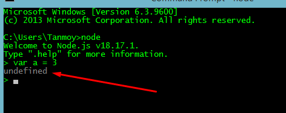
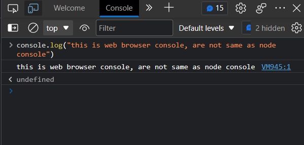
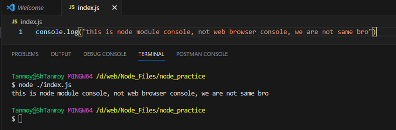
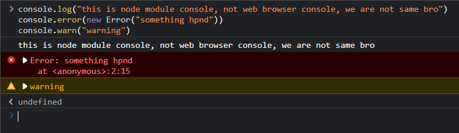

# Node JS - Express JS - MongoDB

## Node js

### What is Node js
• Node is not a Language.
• This is a Server side runtime Environment.
• Node js can connect with databases.
• Code and syntax is very similar to JavaScript.
• But not exactly the same.
• Node is free,open-source.
• Node js use Chrome's V8 engine to execute code.

It provides an event driven, non-blocking (asynchronous) I/O and cross-platform runtime environment for building highly scalable server-side applications using JavaScript.
It’s single thread

### Why do we use Node
• Node js mostly used for API
• So we can connect the same database with Web App, Mobile App.
• Node is easy to understand for those who know Javascript. 
• Node is super-fast for APIs
• With Node and JavaScript, you can become a full Stack Developer.

### Why Should Learn
• If you are a JavaScript developer then you can easy learn Node
• You can become a full-Stack developer
• Free and in Demand for Jobs
• Salary is also good as compare to web-developer or PHP developer.

### History and More
• First Release: May 27, 2009 
• Written in C, C++, JavaScript

### JavaScript & Node are the Same?
• JavaScript and Node js Code Syntax is Same 
• If you know JavaScript you can easily understand Node
• But both are not exactly the Same
• You can not connect Javascript to DB
• Node can connect with DB
• Node js run on the server side
• JavaScript is run on the browser

### What do developers Make with Node js?
• Developers Make API with Node js 
• So we can connect Server with Client
• Node can make API for web, Android and IOS etc.
• Make can also make website

### why undfined
**Because it doesn't return anything hence undefined called**

For open vs-code in cmd = `code .`

**Node module console and web browser console aren’t same but same syntax**

<h2>Branch1</h2>
<b>Global and Nonglobal variable:</b> Global variable should not be imported but non global variable should be imported on code .
`__dirname` = print path
`__filename` = print path + file name 
These are global variables . hence should not be imported , direct use. 
On the other hand, the fs module should be imported.

const fs = require(‘fs’);
fs.writeFileSync(“hello.txt”,”this is text file is made by fs module”)

<h2>Branch2</h2>
Http = it handles request and response in node server

add package.json = `npm init`

Install nodemon = `npm i nodemon`
Run file by nodemon = nodemon fileNam or you do this in package.json file
    "scripts": {
        "start": "node index.js",
        "dev": "nodemon index.js",
        "test": "echo \"Error: no test specified\" && exit 1"
    },
Now in cmd = `npm run dev`

<h2>Branch3</h2>
• Informational responses (100 – 199)
• Successful responses (200 – 299)
• Redirection messages (300 – 399)
• Client error responses (400 – 499)
• Server error responses (500 – 599)

### Status Code:
200 OK
201 Created
202 Accepted
400 Bad Request
401 Unauthorized
402 Payment Required Experimental
403 Forbidden
404 Not Found
500 Internal Server Error
501 Not Implemented
502 Bad Gateway
503 Service Unavailable
504 Gateway Timeout

<h2>Branch4</h2>
`process.argv`, here ‘argv’ is an argument vector . By this command we can get value from cmd . 

<h2>Branch5</h2>
path module, fs module

fs.readdir(folder path, (err,file)=>{....}) = read a folder
path.resolve() = it calculate with absolute path(means root path)
path.join () = it calculate only given path

<h2>Branch6</h2>
CRUD through fs module

• First create text file with text by writeFileSync
• Then read the txt file with readFile in  Buffer type , adding ‘utf-8’ we get actual text
• Added text by appendFile and rename with rename method
• After that delete by unlinkSync

Buffer: Buffer refers to the particular memory location in memory. 

<Buffer 74 68 69 73 20 69 73 20 63 72 75 64 20 6f 70 65 72 61 74 69 6f 6e 20 74 68 72 6f 75 67 68 20 66 73 20 6d 6f 64 75 6c 65>

# For More Read [Docs](https://docs.google.com/document/d/1LkRk34M508ga1KxNey4L5O3v_sYOO8T7x3jbiTG_naU/edit?usp=sharing).

